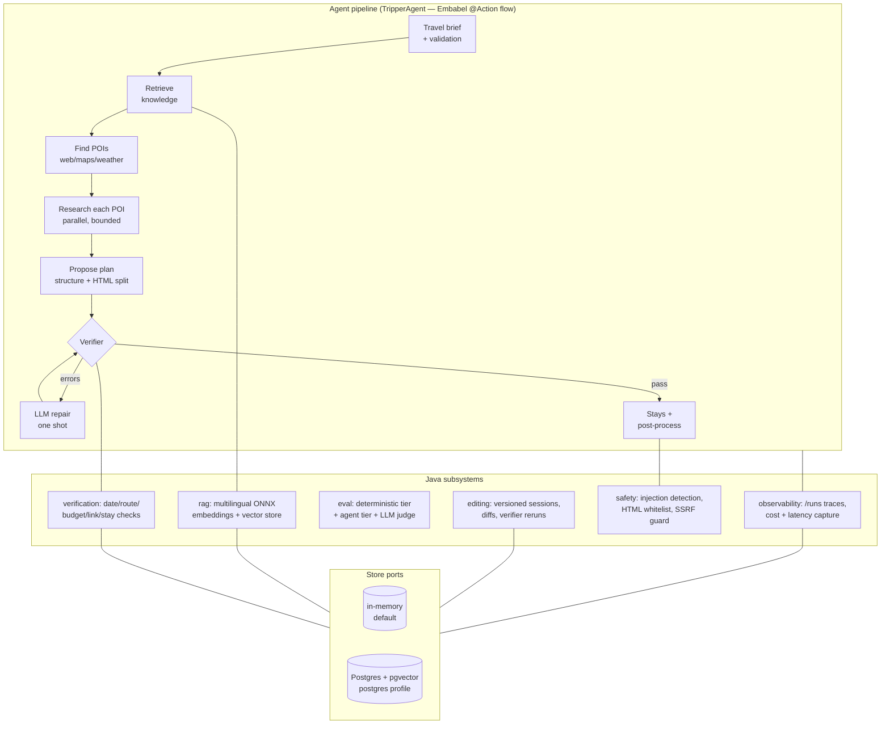

# TripSmith — Production-Oriented AI Travel Planning Agent


TripSmith turns a travel brief ("Barcelona to Bordeaux, 10 days, two travelers, $200/day")
into a verified, day-by-day itinerary. A multi-step LLM agent researches points of interest
with real tools (web search, maps, weather, image search), grounds its plan in the user's own
travel documents (RAG), then runs the result through a **deterministic verifier with an LLM
repair loop** before anything reaches the user. Every run is traced, costed, sanitized and —
on the `postgres` profile — durable.

The interesting part is not the demo; it is the engineering around it: evaluation, guardrails,
observability, cost control, graceful degradation and persistence. See
[PROJECT-NOTE.md](PROJECT-NOTE.md) for an honest map of what is original here versus what
came from the upstream example this project started from.

## Architecture



| Package (`io.github.shibuna.tripsmith`) | Responsibility | Origin |
|---|---|---|
| `agent` | Orchestration, prompts, fallbacks, tracing decorator, model routing | upstream skeleton, rebuilt + decomposed |
| `rag` | Knowledge base: chunking, multilingual embeddings, retrieval, citations | original |
| `verification` | Deterministic itinerary verifier + repair-loop input | original |
| `eval` | Two-tier evaluation harness, 30-case dataset, LLM judge | original |
| `observability` | Per-run action timelines, cost/tokens/latency, `/runs` UI | original |
| `safety` | Prompt-injection detection, HTML whitelist sanitization, SSRF guard, redaction | original |
| `editing` | Versioned plan-edit sessions with diffs and verifier reruns | original |
| `web`, `web.support` | Controllers, form validation, processing flow | upstream baseline, extended |

## Engineering Highlights

**Reliability — never trust the model.** Every plan passes a deterministic verifier (full
date coverage, haversine route estimates from a [data-file city catalog](src/main/resources/verification/city-coordinates.csv),
tiered budget checks, link and stay checks). Blocking errors trigger one structured LLM
repair pass, re-verified. If a planner call still fails after retries, the run degrades to a
deterministic fallback plan assembled from already-validated research instead of erroring —
and date gaps are closed in code (`completeDays`) so models that drop dates cannot break
plans.

**Cost engineering — measured, not vibes.** Tool calls are capped per action (default 4),
per-POI research is truncated to 500 characters before planning, POI count scales with trip
length under a hard ceiling, and the plan is generated as a small JSON structure plus a
plain-text HTML body so weak-JSON models never emit HTML inside JSON. A measured end-to-end
run costs **$0.45 (Chinese/Kimi) to $0.52 (English/Claude)**; the web flow validates input
server-side *before* any model call spends money.

**Safety — both directions.** Retrieved web/knowledge content is treated as untrusted:
injection patterns are detected, suspicious instruction lines stripped, and tool policies
injected per action. On the output side the LLM's HTML goes through a jsoup whitelist (the
page renders it raw, so this is the XSS boundary), URL imports are SSRF-guarded
(public-unicast-only hosts, no redirects, size caps), and traces redact secrets.

**Evaluation — two honest tiers.** A deterministic tier runs in CI against a 30-case dataset
and regression-tests the verifier and metrics pipeline (date coverage, budget violations,
invalid links, citation coverage, latency/cost accounting). A gated agent tier
(`EVAL_AGENT=true`) runs the real agent end to end and scores plans with a separate LLM-judge
agent on relevance, theme coverage, route sanity, constraint adherence and prose quality.

**Persistence — ports and adapters.** Traces, edit sessions, knowledge documents and
verifier results sit behind store interfaces: in-memory adapters by default (zero
dependencies), JPA adapters plus a pgvector index on the `postgres` profile. Verified: data
and vector retrieval survive restarts.

**Multilingual.** Chinese-language briefs route to domestic models (Moonshot) end to end, and
the RAG embedding default is a multilingual model — a Chinese synonym query retrieves the
right Chinese document at 0.76 similarity where the previous English-only model scored noise.

## Quick Start

> A real planning run uses paid LLM and tool APIs (~$0.5/run). The homepage and knowledge
> pages work with dummy keys.

```bash
# 1. Keys (dummy values are enough for a UI smoke test)
export OPENAI_API_KEY=... BRAVE_API_KEY=...
export GOOGLE_CLIENT_ID=dummy GOOGLE_CLIENT_SECRET=dummy

# 2. MCP tools + tracing (optional, needed for real runs)
cp mcp.env.example .mcp.env   # add brave/google-maps keys
docker compose up -d mcp-gateway zipkin

# 3. Run (in-memory tier)
./mvnw -Dmaven.test.skip=true spring-boot:run
# → http://localhost:8747  (knowledge base: /knowledge, run traces: /runs)

# Durable tier: Postgres + pgvector
docker compose up -d postgres
SPRING_PROFILES_ACTIVE=postgres,gateway ./mvnw -Dmaven.test.skip=true spring-boot:run
```

Evaluation:

```bash
# Deterministic tier (offline, free)
./mvnw -q -DskipTests compile exec:java -Dexec.mainClass=io.github.shibuna.tripsmith.eval.TravelEvaluationCli

# Agent tier (real LLM + tools + judge; costs money)
EVAL_AGENT=true ./mvnw test -Dtest=AgentEvaluationIT
```

Reports land in `target/evals/` as JSON and Markdown. Full setup details, the demo request
script and a macOS proxy gotcha are in [LOCAL-DEVELOPMENT.md](LOCAL-DEVELOPMENT.md);
architecture and file responsibilities in [infra.md](infra.md); the staged roadmap in
[README-AI-APPLICATION-PLAN.md](README-AI-APPLICATION-PLAN.md).

## Tech

Kotlin + Java 21, Spring Boot 3.5, [Embabel Agent Framework](https://github.com/embabel/embabel-agent)
(GOAP-planned `@Action` agents, MCP tools), Spring AI (local ONNX embeddings, pgvector),
PostgreSQL + pgvector, jsoup, htmx + Thymeleaf, Docker Compose, GitHub Actions.

## Attribution & License

TripSmith is built on the [Embabel Agent Framework](https://github.com/embabel/embabel-agent)
and started from the open-source [Embabel Tripper](https://github.com/embabel/tripper)
example application — the agent skeleton, domain model, tool wiring and htmx UI came from
there, and upstream-derived files keep their Apache license headers. Everything described
under "original" in [PROJECT-NOTE.md](PROJECT-NOTE.md) was built on top. Licensed under the
[Apache License 2.0](LICENSE); see [NOTICE](NOTICE).
