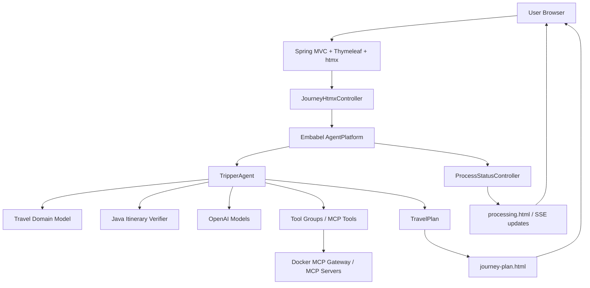

# Tripper Project Infrastructure

本文档用于说明 Tripper 项目的整体架构、分层职责和逐文件职责。当前项目是一个基于 Kotlin、Spring Boot 和 Embabel Agent Framework 的 AI 旅行规划应用。

## 1. 项目整体定位

Tripper 是一个旅行规划 Agent 应用。用户在 Web 表单中输入出发地、目的地、日期、预算、交通偏好和旅行者画像后，后端通过 Embabel Agent 执行多阶段规划流程：

1. 根据用户 brief 和 traveler profile 寻找兴趣点。
2. 对每个兴趣点进行并发调研。
3. 汇总调研结果生成结构化旅行计划。
4. 对行程做确定性校验，并在发现阻塞问题时触发一次结构化修复。
5. 根据每天停留地点寻找住宿链接。
6. 对最终行程做住宿、预算、链接和路线一致性校验。
7. 对 HTML 和图片链接做后处理。
8. 通过 Thymeleaf/htmx 页面展示最终结果和执行过程。

项目的 AI 能力主要来自：

- Embabel Agent 的 action/goal 编排。
- OpenAI 模型调用。
- MCP 工具调用，包括 Web、Maps、Weather、Browser Automation、Airbnb 等。
- 结构化领域模型，约束 LLM 输出为可被程序继续处理的数据对象。
- Java 实现的 RAG 和行程校验模块，用于展示个人扩展能力。

## 2. 总体架构



## 3. 分层职责

### 3.1 Web/UI Layer

职责：

- 展示旅行规划输入表单。
- 接收用户提交的表单数据。
- 展示异步 Agent 执行状态。
- 展示最终旅行计划、地图链接、住宿链接、参考链接和执行成本。

主要文件：

- `src/main/kotlin/com/embabel/tripper/web/JourneyHtmxController.kt`
- `src/main/kotlin/com/embabel/agent/web/htmx/ProcessStatusController.kt`
- `src/main/resources/templates/**`
- `src/main/resources/static/css/**`

### 3.2 Application / Agent Orchestration Layer

职责：

- 启动 Spring Boot 应用。
- 注册 Embabel Agent。
- 创建并启动 AgentProcess。
- 将多个 Agent action 串成完整旅行规划流程。

主要文件：

- `src/main/kotlin/com/embabel/tripper/TripperApplication.kt`
- `src/main/kotlin/com/embabel/tripper/agent/TripperAgent.kt`

### 3.3 Domain Layer

职责：

- 定义旅行规划业务对象。
- 将用户输入、LLM 中间结果和最终结果结构化。
- 提供少量确定性计算逻辑，例如 Google Maps 路线链接生成。

主要文件：

- `src/main/kotlin/com/embabel/tripper/agent/domain.kt`

### 3.4 Tool Integration Layer

职责：

- 暴露外部工具给 Agent 使用。
- 接入 Brave Search。
- 接入 MCP 工具组。
- 将 Docker/MCP 工具按 role 注册成 Embabel ToolGroup。

主要文件：

- `src/main/kotlin/com/embabel/tripper/Brave.kt`
- `src/main/kotlin/com/embabel/tripper/config/ToolsConfig.kt`
- `compose.yaml`
- `compose.dmr.yaml`
- `compose.ollama.yaml`
- `src/main/resources/application-docker-ce.yml`

### 3.5 Security Layer

职责：

- 提供可选 Google OAuth2 登录。
- 在 `embabel.security.enabled=false` 时允许无认证访问，方便 demo。
- 在开启安全配置时保护非静态资源页面。

主要文件：

- `src/main/kotlin/com/embabel/agent/web/security/SecurityConfig.kt`
- `src/main/kotlin/com/embabel/agent/web/security/CustomOAuth2UserService.kt`
- `src/main/kotlin/com/embabel/agent/web/security/LoginController.kt`
- `src/main/kotlin/com/embabel/agent/web/security/UserController.kt`
- `README-SECURITY.md`

### 3.6 Configuration / Runtime Layer

职责：

- 定义服务端口、模型、persona、工具、日志、安全等配置。
- 定义 Maven 构建、Docker 镜像、Docker Compose 服务和 CI。

主要文件：

- `pom.xml`
- `src/main/resources/application.yml`
- `src/main/resources/application-docker-ce.yml`
- `Dockerfile`
- `compose.yaml`
- `.github/workflows/maven.yml`

### 3.7 Test Layer

职责：

- 放置单元测试和集成测试。
- 当前测试覆盖较弱，主要是一个未完成的 travel plan mapping 测试样例。

主要文件：

- `src/test/kotlin/com/embabel/example/travel/agent/TravelPlanTest.kt`

## 4. 核心运行链路

### 4.1 首页加载

1. 浏览器访问 `/` 或 `/travel/journey`。
2. `JourneyHtmxController.showPlanForm()` 创建默认 `JourneyPlanForm`。
3. Thymeleaf 渲染 `journey-form.html`。
4. 页面展示出发地、目的地、日期、预算、交通方式和 traveler 信息输入项。

### 4.2 提交旅行计划

1. 用户提交表单到 `/travel/journey/plan`。
2. `JourneyHtmxController.planJourney()` 将表单转换为：
   - `JourneyTravelBrief`
   - `Travelers`
3. Controller 从 `AgentPlatform` 中找到 Tripper Agent。
4. Controller 创建 `AgentProcess`，设置 token budget 和 verbosity。
5. Controller 启动 agent process。
6. 页面返回 `common/processing.html`，开始显示执行状态。

### 4.3 Agent 执行流程

`TripperAgent` 中的主要 action 顺序如下：

1. `confirmExpensiveOperation`
   - 根据入口判断是否需要用户确认高成本操作。
2. `findPointsOfInterest`
   - 调用 LLM 和 Web/Maps/Math/Weather 工具寻找兴趣点。
   - 输出 `ItineraryIdeas`。
3. `researchPointsOfInterest`
   - 对每个 `PointOfInterest` 并发调研。
   - 使用 Web、Browser Automation、Weather 和 Brave 图片搜索。
   - 输出 `PointOfInterestFindings`。
4. `proposeTravelPlan`
   - 汇总兴趣点调研信息，生成 `ProposedTravelPlan`。
   - 要求 LLM 输出 HTML 计划、每日地点、图片、视频、页面链接和访问国家。
5. `verifyAndRepairTravelPlan`
   - 调用 Java `ItineraryVerificationService` 校验日期覆盖、地点、预算、链接和路线估算。
   - 如果存在 ERROR 级问题，将 `PlanVerificationResult` 作为结构化 repair prompt 传回 planner。
   - 输出 `VerifiedTravelPlanProposal`。
6. `findPlacesToSleep`
   - 根据每天停留城市分组。
   - 调用 Airbnb 工具寻找住宿搜索链接。
   - 输出 `TravelPlan`。
   - 住宿结果生成后再次执行最终校验，并把 `PlanVerificationResult` 放入 `TravelPlan`。
7. `postProcessHtml`
   - 给图片添加样式。
   - 删除无效图片链接。
   - 作为 `makeTravelPlan` goal 的最终输出。

### 4.4 状态轮询和结果展示

1. `common/processing.html` 展示等待状态、事件流和执行详情。
2. `ProcessStatusController.checkPlanStatus()` 根据 `AgentProcess` 状态返回不同视图：
   - `COMPLETED`：注入最终结果并返回 `journey-plan.html`。
   - `FAILED`：返回 `common/processing-error.html`。
   - `TERMINATED`：返回 `common/processing-error.html`。
   - 其他状态：继续显示 `common/processing.html`。
3. `journey-plan.html` 展示最终计划、地图链接、住宿链接、参考页面、视频链接和执行摘要。

## 5. 逐目录说明

```text
.
├── src/main/kotlin
│   ├── com/embabel/tripper
│   │   ├── agent
│   │   ├── config
│   │   ├── util
│   │   └── web
│   └── com/embabel/agent/web
│       ├── htmx
│       └── security
├── src/main/java
│   └── com/embabel/tripper
│       ├── rag
│       └── web
├── src/main/resources
│   ├── templates
│   ├── static
│   └── application*.yml
├── src/test/kotlin
├── images
├── .github/workflows
├── Dockerfile
├── compose*.yaml
└── pom.xml
```

### 5.1 `src/main/kotlin/com/embabel/tripper`

项目业务主包，包含应用入口、Agent、领域模型、外部服务和 Web Controller。

### 5.1.1 `src/main/java/com/embabel/tripper`

个人新增 Java 主包。当前 Phase 1 RAG MVP 放在这里，包括知识库领域对象、内存索引、检索服务和知识库管理 Controller。

### 5.2 `src/main/kotlin/com/embabel/agent/web`

通用 Web 支撑包，包含 htmx 处理页面、安全配置、登录和用户信息页面。虽然包名是 `com.embabel.agent.web`，但当前代码被本项目直接使用。

### 5.3 `src/main/resources/templates`

Thymeleaf 页面模板目录。负责渲染输入表单、处理中页面、最终结果页、登录页、平台页和公共布局。

### 5.4 `src/main/resources/static`

静态资源目录。当前主要是 CSS。

### 5.5 `src/test/kotlin`

测试目录。当前只有一个 travel plan 相关测试样例，覆盖不足。

### 5.6 `images`

README 中引用的项目截图，包括输入页、输出页、地图、Airbnb 链接、执行计划和事件流截图。

### 5.7 `.github/workflows`

GitHub Actions CI 配置目录。

## 6. 逐文件职责

### 6.1 根目录文件

| 文件 | 职责 |
| --- | --- |
| `README.md` | 原项目主说明文档，介绍 Tripper 功能、运行方式、截图、架构和开发说明。 |
| `PROJECT-NOTE.md` | 说明本 fork 与上游 Embabel Tripper 的关系，以及当前个人扩展范围。 |
| `LOCAL-DEVELOPMENT.md` | 本地开发指南，说明环境变量、MCP secret、测试、运行和 demo 请求。 |
| `README-AI-APPLICATION-PLAN.md` | 个人扩展计划文档，说明如何把项目升级成更适配 AI 应用岗位的作品。 |
| `infra.md` | 当前文件，说明项目整体架构、分层职责和逐文件职责。 |
| `README-SECURITY.md` | Google OAuth2 和安全配置说明。 |
| `pom.xml` | Maven 构建文件，定义 Spring Boot、Kotlin、Embabel、OpenAI、MCP、Security、Thymeleaf 和测试依赖。 |
| `mvnw` / `mvnw.cmd` | Maven Wrapper 启动脚本，用于在未安装 Maven 的机器上运行构建。 |
| `Dockerfile` | 多阶段 Docker 构建文件，使用 Maven 构建 Spring Boot jar，并在运行阶段启动应用。 |
| `compose.yaml` | Docker Compose 主文件，定义 MCP Gateway、Zipkin 和可选 `agent` 服务。 |
| `compose.dmr.yaml` | Docker Model Runner 相关模型服务定义。 |
| `compose.ollama.yaml` | Ollama 本地模型服务定义。 |
| `mcp.env.example` | MCP secret 示例文件，包含 Brave 和 Google Maps key 的占位配置。 |
| `run.sh` | 本机启动脚本，执行 `./mvnw -Dmaven.test.skip=true spring-boot:run`。 |
| `scripts/demo-plan-request.sh` | 示例表单提交脚本，用固定旅行输入触发一次本地 planning run。 |
| `LICENSE` | Apache License 2.0。 |

### 6.2 Application 文件

| 文件 | 职责 |
| --- | --- |
| `src/main/kotlin/com/embabel/tripper/TripperApplication.kt` | Spring Boot 入口。启用配置属性扫描和 Embabel Agent 扫描，并配置 Docker Desktop MCP server 类型。 |

### 6.3 Agent 和领域模型文件

| 文件 | 职责 |
| --- | --- |
| `src/main/kotlin/com/embabel/tripper/agent/TripperAgent.kt` | 项目核心 Agent。定义旅行规划 action，包括成本确认、兴趣点发现、兴趣点调研、计划生成、校验/修复、住宿搜索和 HTML 后处理。 |
| `src/main/kotlin/com/embabel/tripper/agent/domain.kt` | 旅行领域模型。定义 `JourneyTravelBrief`、`Travelers`、`PointOfInterest`、`ItineraryIdeas`、`ResearchedPointOfInterest`、`ProposedTravelPlan`、`Stay`、`TravelPlan` 等数据结构；最终 `TravelPlan` 持有知识库上下文和校验结果。 |

### 6.3.1 Java RAG 文件

| 文件 | 职责 |
| --- | --- |
| `src/main/java/com/embabel/tripper/rag/TravelKnowledgeSourceType.java` | 知识来源类型枚举，包括粘贴文本、上传文件和 URL。 |
| `src/main/java/com/embabel/tripper/rag/TravelKnowledgeDocument.java` | 用户导入的知识文档模型。 |
| `src/main/java/com/embabel/tripper/rag/TravelKnowledgeHit.java` | 检索命中的 chunk 结果，包含分数、来源和 citation id。 |
| `src/main/java/com/embabel/tripper/rag/TravelKnowledgeContext.java` | 可注入 Agent prompt 的知识上下文，实现 `PromptContributor`。 |
| `src/main/java/com/embabel/tripper/rag/IndexedTravelKnowledgeChunk.java` | 内部索引 chunk 模型，保存 chunk 文本和 term vector。 |
| `src/main/java/com/embabel/tripper/rag/TravelKnowledgeRepository.java` | 内存知识库 repository，保存文档和 chunk。 |
| `src/main/java/com/embabel/tripper/rag/TravelKnowledgeService.java` | Java RAG 核心服务，负责导入、HTML 转文本、切 chunk、term-vector 检索和构造知识上下文。 |
| `src/main/java/com/embabel/tripper/web/TravelKnowledgeController.java` | Java Controller，提供 `/knowledge` 管理页和 `/knowledge/debug` 检索调试页。 |

### 6.3.2 Java 行程校验文件

| 文件 | 职责 |
| --- | --- |
| `src/main/java/com/embabel/tripper/verification/VerificationSeverity.java` | 校验问题严重级别枚举：`INFO`、`WARNING`、`ERROR`。 |
| `src/main/java/com/embabel/tripper/verification/PlanIssueCategory.java` | 校验问题分类枚举，包括日期、路线、预算、链接和住宿问题。 |
| `src/main/java/com/embabel/tripper/verification/ItineraryDay.java` | Java verifier 的每日行程输入 DTO，避免 Java 编译期依赖 Kotlin domain。 |
| `src/main/java/com/embabel/tripper/verification/ItineraryLink.java` | Java verifier 的链接输入 DTO，标记链接来源字段和 URL。 |
| `src/main/java/com/embabel/tripper/verification/ItineraryStay.java` | Java verifier 的住宿输入 DTO，保存住宿覆盖日期和住宿链接。 |
| `src/main/java/com/embabel/tripper/verification/ItineraryVerificationRequest.java` | Java verifier 的统一输入请求，承载 brief、plan、days、links 和 stays。 |
| `src/main/java/com/embabel/tripper/verification/PlanVerificationIssue.java` | 单个结构化校验问题，包含类别、级别、日期、地点、消息和修复提示详情。 |
| `src/main/java/com/embabel/tripper/verification/TravelLegEstimate.java` | 相邻地点之间的路线估算结果，包含距离、耗时、估算方法和是否过长。 |
| `src/main/java/com/embabel/tripper/verification/PlanVerificationResult.java` | 一次行程校验结果，实现 `PromptContributor`，可直接作为 repair prompt 的结构化上下文。 |
| `src/main/java/com/embabel/tripper/verification/PlanVerificationRepository.java` | 内存校验结果 repository，保存最近 planning run 的校验输出。 |
| `src/main/java/com/embabel/tripper/verification/ItineraryVerificationService.java` | Java 校验核心服务，负责日期覆盖、地点、路线估算、预算、URL、住宿覆盖等确定性校验。 |

### 6.4 外部工具和配置文件

| 文件 | 职责 |
| --- | --- |
| `src/main/kotlin/com/embabel/tripper/Brave.kt` | Brave Search 集成。封装 web/news/image/video search service，其中 `BraveImageSearchService.searchImages()` 作为 Agent 可调用工具。 |
| `src/main/kotlin/com/embabel/tripper/config/ToolsConfig.kt` | Spring 配置。创建 `RestClient`，并把 MCP Airbnb 工具过滤注册成 Embabel `ToolGroup`。 |
| `src/main/kotlin/com/embabel/tripper/util/ImageChecker.kt` | HTML 图片链接校验器。扫描 `` 标签，通过 HTTP HEAD 检查图片链接是否有效，并移除无效图片。 |

### 6.5 Web Controller 文件

| 文件 | 职责 |
| --- | --- |
| `src/main/kotlin/com/embabel/tripper/web/JourneyHtmxController.kt` | 旅行规划主 Controller。负责展示表单、接收提交、转换表单到领域对象、创建并启动 AgentProcess。 |
| `src/main/kotlin/com/embabel/agent/web/htmx/GenericProcessingValues.kt` | 通用 processing 页面模型对象。把 process id、页面标题、详情、结果 key 和成功视图写入 Spring `Model`。 |
| `src/main/kotlin/com/embabel/agent/web/htmx/PlatformController.kt` | `/platform` 页面 Controller，返回平台信息页面模板。 |
| `src/main/kotlin/com/embabel/agent/web/htmx/ProcessStatusController.kt` | AgentProcess 状态 Controller。根据 process 状态返回处理中、成功结果或错误页面。 |

### 6.6 Security 文件

| 文件 | 职责 |
| --- | --- |
| `src/main/kotlin/com/embabel/agent/web/security/SecurityConfig.kt` | Spring Security 配置。根据 `embabel.security.enabled` 决定是否启用 OAuth2 认证。 |
| `src/main/kotlin/com/embabel/agent/web/security/CustomOAuth2UserService.kt` | Google OAuth2 用户加载逻辑。把 OAuth2 用户包装为带 `ROLE_USER` 的 `DefaultOAuth2User`。 |
| `src/main/kotlin/com/embabel/agent/web/security/LoginController.kt` | `/login` 登录页 Controller。 |
| `src/main/kotlin/com/embabel/agent/web/security/UserController.kt` | `/user` 用户信息页 Controller。把 OAuth2 用户姓名、邮箱、头像等信息写入模型。 |

### 6.7 Resource 配置文件

| 文件 | 职责 |
| --- | --- |
| `src/main/resources/application.yml` | 默认应用配置。定义端口 `8747`、Thymeleaf、静态资源缓存、安全开关、weather tool、Tripper persona、模型和日志级别。 |
| `src/main/resources/application-docker-ce.yml` | Docker CE / stdio MCP 配置。定义 Brave、fetch、puppeteer、wikipedia、github、google-maps 等 MCP server 的 Docker 启动方式。 |

### 6.8 Thymeleaf 页面模板

| 文件 | 职责 |
| --- | --- |
| `src/main/resources/templates/journey-form.html` | 旅行规划输入表单。支持出发地、目的地、交通方式、日期、预算、多个 traveler 和 brief 输入。 |
| `src/main/resources/templates/journey-plan.html` | 最终旅行计划页面。展示标题、brief、traveler、地图链接、HTML 计划正文、校验状态、知识来源、Airbnb 住宿链接、参考页面和视频链接。 |
| `src/main/resources/templates/login.html` | 登录页面。提供 Google OAuth2 登录入口，并显示登录错误和退出提示。 |
| `src/main/resources/templates/common/layout.html` | 公共页面布局。加载 CSS、可选 htmx/SSE 脚本、用户 fragment、内容区域和 footer。 |
| `src/main/resources/templates/common/platform.html` | 平台信息页面。链接到 Agent、Tool Groups、Models 和 Zipkin。 |
| `src/main/resources/templates/common/processing.html` | Agent 执行中页面。显示过程状态、终止按钮、事件流、计划步骤和前端更新脚本。 |
| `src/main/resources/templates/common/processing-error.html` | Agent 执行失败或终止页面。 |
| `src/main/resources/templates/common/user-info.html` | 用户资料页。展示 OAuth2 用户头像、姓名、邮箱和退出按钮。 |
| `src/main/resources/templates/common/fragments/empty.html` | 空 fragment，用于 layout 中没有额外 head 内容时占位。 |
| `src/main/resources/templates/common/fragments/footer.html` | 公共 footer fragment。 |
| `src/main/resources/templates/common/fragments/plan-complete.html` | 计划完成后的执行摘要 fragment，展示 goal、action history、成本、模型和 token 使用量。 |
| `src/main/resources/templates/common/fragments/user.html` | 用户认证状态 fragment，展示用户入口或 logout 表单。 |

### 6.9 静态资源文件

| 文件 | 职责 |
| --- | --- |
| `src/main/resources/static/css/embabel-common-dark.css` | 通用深色主题样式。 |
| `src/main/resources/static/css/project.css` | Tripper 项目自定义样式。 |

### 6.10 测试文件

| 文件 | 职责 |
| --- | --- |
| `src/test/kotlin/com/embabel/example/travel/agent/TravelPlanTest.kt` | Travel plan 相关测试占位。当前构造了 `ProposedTravelPlan`，但没有实际断言，需要后续补强。 |
| `src/test/java/com/embabel/tripper/rag/TravelKnowledgeServiceTest.java` | Java RAG 服务测试，验证文档导入、检索、citation 和 prompt context。 |

### 6.11 CI 文件

| 文件 | 职责 |
| --- | --- |
| `.github/workflows/maven.yml` | GitHub Actions 构建流程。使用 JDK 21 运行 `./mvnw -U -B test verify`，并在 main 分支失败/恢复时触发通知 workflow。 |

### 6.12 图片资源

| 文件 | 职责 |
| --- | --- |
| `images/input1.jpg` | README 中的输入页截图。 |
| `images/output1.jpg` | README 中的生成结果截图。 |
| `images/map.jpg` | README 中的地图链接截图。 |
| `images/airbnb.jpg` | README 中的 Airbnb 链接截图。 |
| `images/plan.jpg` | README 中的计划和使用量截图。 |
| `images/process.jpg` | README 中的事件流截图。 |

## 7. 当前架构的关键边界

### 7.1 LLM 负责的部分

- 根据 brief 和 traveler 信息生成兴趣点。
- 调研兴趣点并生成自然语言说明。
- 汇总调研内容生成 HTML 旅行计划。
- 根据停留地点生成 Airbnb 搜索 URL。

### 7.2 程序确定性负责的部分

- 表单到领域对象的转换。
- Agent action 编排。
- 并发执行兴趣点调研和住宿搜索。
- 根据 `Day.locationAndCountry` 生成 Google Maps 路线链接。
- 图片 HTML 样式后处理。
- 图片 URL 有效性检查。
- Spring MVC 页面路由和状态分发。

### 7.3 外部系统负责的部分

- OpenAI 提供 LLM 和 embedding model。
- Brave 提供搜索结果和图片搜索结果。
- Docker MCP Gateway 提供外部 MCP 工具接入。
- Google Maps、Airbnb、Wikipedia、Puppeteer 等通过 MCP 工具被间接调用。
- Zipkin 用于链路追踪入口。

## 8. 后续扩展建议对应的架构位置

如果后续要增强为更适配 AI 应用岗位的项目，可以按以下位置扩展：

| 扩展方向 | 建议新增位置 | 说明 |
| --- | --- | --- |
| RAG 知识库 | `src/main/java/com/embabel/tripper/rag` | Java-owned MVP：文档上传、切分、内存 term-vector 检索、citation；后续替换为 embedding/vector store。 |
| 行程校验器 | `src/main/java/com/embabel/tripper/verification` | Java-owned MVP：日期、预算、路线、链接、住宿一致性校验；后续可替换为 maps-backed verifier。 |
| Agent 评测 | `src/test/kotlin` 和 `evals/` | 测试集、质量指标、回归报告。 |
| 可观测性 | `src/main/kotlin/com/embabel/tripper/observability` | token、cost、latency、tool call、action trace。 |
| Guardrails | `src/main/kotlin/com/embabel/tripper/safety` | prompt injection 防护、工具权限、敏感信息脱敏。 |
| 多轮编辑 | `src/main/kotlin/com/embabel/tripper/editing` | plan version、diff、局部重排、repair loop。 |

## 9. 本地运行入口

本机运行入口：

```bash
./mvnw -Dmaven.test.skip=true spring-boot:run
```

默认访问地址：

```text
http://localhost:8747/
```

健康检查：

```text
http://localhost:8747/actuator/health
```

完整生成旅行计划需要配置：

- `OPENAI_API_KEY`
- `BRAVE_API_KEY`
- MCP 相关 secret，例如 `.mcp.env`
- 如启用 OAuth2，还需要 `GOOGLE_CLIENT_ID` 和 `GOOGLE_CLIENT_SECRET`
